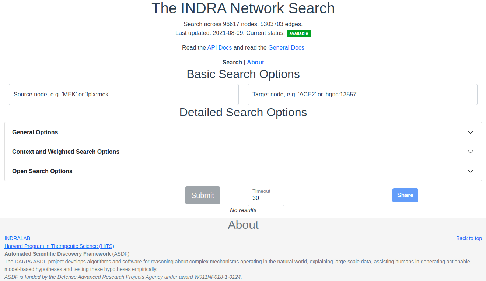
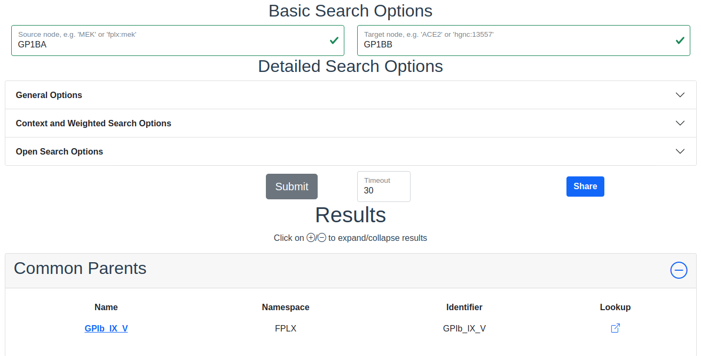

=====================
Network Search Web UI
=====================
This document introduces the web interface of the INDRA Network Search Service

  *The network search interface with no input or results.*

Source and Target
-----------------
The source and target are the nodes between which to find a path and at least
one of source and target is needed to do a search. If only one of source or
target is provided, an open ended breadth first search is done instead of a
path search. Note that the source and target are not affected by the choice of
*allowed namespaces* (see below) <-- provide internal link.

Autocompleting source/target inputs
~~~~~~~~~~~~~~~~~~~~~~~~~~~~~~~~~~~
Autocompletion of source/target based on prefix and entity identifier are
made automatically as an input is typed or pasted into the text boxes. The
suggestions are picked from the nodes in the graph and the text box will
mark the entered text as correct if it matches an existing node in the graph.
ADD IMAGE WITH CORRECT NODE AND SUGGESTIONS

Detailed Search Options - General Options
-----------------------------------------

Path Length
~~~~~~~~~~~
Only paths of this many edges will be returned. Must be a positive integer.

Node Blacklist
~~~~~~~~~~~~~~
Node names entered here are skipped in the path search. This is a good way
to avoid nodes of extremely high degree that overwhelms the results and
effectively blocks out results that include nodes of lower degree. *See also
Cull Highest Degree Node below.* <-- provide internal link

Max Paths
~~~~~~~~~
The maximum number of results to return per category in the results. The
default and the maximum allowed is 50 results. For unweighted searches this
number rarely makes a perceivable difference in response time but for
weighted searches keep this number low for a faster response time.

Signed Search
~~~~~~~~~~~~~
To perform a signed search, click on the drop down menu that says "No sign"
and chose a sign. "+" means that the returned paths are upregulations,
and "-" means that the returned paths are downregulations. For the
purpose of signed search, only statements that imply a clear up- or
downregulation are considered. Currently this mean `IncreaseAmount` and
`Activation` for upregulation, and `DecreaseAmount` and `Inhibition` for
downregulation.

Highest Degree Node Culling Frequency
~~~~~~~~~~~~~~~~~~~~~~~~~~~~~~~~~~~~~
Entering a positive integer here allows the path search to include the highest
degree node for the first N returned paths, after which that node is added to
the *Node Blacklist*. <-- internal link This is repeated for the second highest degree node for
the following N paths, then for the third highest degree node and so forth.
*Limitations:* This option is only applied to unweighted open search and
source-target searches.

Belief Cutoff
~~~~~~~~~~~~~
Any statement with a belief score below this number will be excluded from the
edge support. If all statements are excluded from the edge, all paths
containing that edge become invalid and are skipped. It is set to zero by
default to include all edges. Read more about belief scores in the `belief
module <https://indra.readthedocs.io/en/latest/modules/belief/index.html>`_ of
INDRA.

Allowed Statement Types
~~~~~~~~~~~~~~~~~~~~~~~
This is a multiselect dropdown which contains multiple statement types to
allow in the results. If an edge of a path does not contain any of the
selected statement types, the whole path will be skipped from the result.
Read more about statement types in the
`statements module <https://indra.readthedocs.io/en/latest/modules/statements.html>`_
of INDRA.

Allowed Node Namespaces
~~~~~~~~~~~~~~~~~~~~~~~
The namespaces included here are the ones that are allowed on any node
visited in the path search. The namespace of the source and target are
excluded from this restriction. A namespace in INDRA is the prefix or name of
the *type* of identifier used to uniquely identify an entity from a specific
knowledge source. For example, a chemical can be identified using a `CHEBI`
identifier and would then be identified in the `CHEBI` namespace.

Checkboxes
~~~~~~~~~~
The following options are available as checkboxes:

- **Only Database Supported Sources**: Check this box to enforce that all
  edges must be supported by at least one statement sourced from curated
  databases like PathwayCommons and Signor
- **Allow Ontological Edges**: Check this box to allow directed edges that go
  from an entity to its ontological parent, e.g. from the NFKB1 sub-unit to
  the NFkappaB complex.
- **Include Reverse Search**: Check this box to also search for paths with
  source and target swapped. With this option, the reverse search *from*
  target *to* source is done as well as the original search from source to
  target. If the timeout is reached (see below) before the reverse search can
  start, the reverse search will not return any paths. If the timeout is
  reached during the reverse search, fewer paths than for the original search
  will be returned.
- **Include Search for Shared Regulators of Source/Target**: Check this box
  to include a search for common upstream nodes one edge away from both
  source and target. This option is only available when both source and
  target specified.

Detailed Search Options - Context and Weighted Search Options
-------------------------------------------------------------
This section of the search options allows control over how to prioritize or
*weight* edges in paths differently. During weighted search, the cost along
every path encountered is calculated as the sum of the edge weights along the
path. The paths are returned in ascending order of cost.

The different ways of weighting the search are available in the dropdown menu
"Weighted Search". *Note:* A weighted search is costly and usually takes
longer than an unweighted search. It is common that a very heavy weighted
search times out, especially for a *signed weighted* search, even with the
highest allowed timeout of 120 seconds.

The weighted search uses a slightly modified version of the Djikstra weighted
search employed in Networkx.

The code implemented for the weighted search is available on `github
<https://github.com/sorgerlab/indra/blob/master/indra/explanation/pathfinding/pathfinding.py>`_
in the functions `shortest_simple_paths()` and `open_dijkstra_search()` for
closed and open paths, respectively.

Unweighted
~~~~~~~~~~
This is the default option and imposes no weight on the edges and is
equivalent to all edges having a unit weight.

Belief Weighted
~~~~~~~~~~~~~~~
The belief weight of an edge is calculated as the negative log of the
aggregated belief scores of all the statements supporting edge :math:`e`:

.. math::
    w_e = -\log \left( 1 - \prod_i \left(1 - b_i \right) \right)

where :math:`b_i` is the belief score of supporting statement :math:`i` of
edge :math:`e`. Since the belief score is limited to the interval
:math:`[0, 1]`, it can interpreted as a probability and the above weight can
therefore be seen as the log of the *complement* to the probability that every
supporting statement is *incorrect*.

DepMap z-score weighted
~~~~~~~~~~~~~~~~~~~~~~~
The z-score edge weight is focused around prioritizing edges between human
genes that have been targeted in knockout screens performed at the Broad
Institute's Dependency Map project. The z-score is obtained from first
calculating the pearson correlation between all pairs of genes in the gene
knockout screen. Then the log of the p-values of the correlations are
calculated using the CDF of the beta distribution. Finally the strength of the
z-scores are obtained from the p-values and the signs are recuperated from the
original correlation matrix.

The edge weight, assuming both nodes are human genes, is calculated by
normalizing the difference between the z-score associated with a
self-correlation and the strength of the z-score between the two nodes of
the edge. In the case that one or both of the nodes of the edge are non-gene
entities, the z-score weight is set to 1:

.. math::
    w_e =
    \begin{cases}
      1                      & \quad \text{if } z_e = z_0\\
      \frac{ z_0 - \left| z_e \right| }{z_0}  & \quad \text{if } z_e \neq z_0
    \end{cases}

where :math:`z_0` is the z-score associated with self correlation and
:math:`z_e` is the z-score of the edge.

Mesh Context
~~~~~~~~~~~~
The context based search allows a search to prioritize or only include
connections that are relevant to the provided context. The context is given
as MeSH terms.

- **MeSH IDs:** Enter the MeSH IDs, separated by comma, that should be
  used in the search.
- **Strict Filtering on MeSH IDs:** Check this box to *only* allow edges with
  associated with the provided MeSH IDs. If left unchecked, the search is
  weighted.
- **Constants** :math:`C` **and** :math:`T_k`: These two constant allow for
  changing the importance of the context in a weighted context based search.
  For any edge :math:`e`, the weight :math:`w_e` of the edge in the context
  based search is calculated in the following way:

.. math::
    w_e = -C \cdot \log\left(\frac{\text{refcount}}{\text{total} + T_k}\right)

Here, `refcount` is the number of references with the associated MeSH
ID(s) that are supporting edge :math:`e` and `total` is the total number of
references supporting edge :math:`e`.

Detailed Search Options - Open Search Options
---------------------------------------------
Options under the Open Search Options are only applied during open searches,
i.e. when either of source or target is provided.

Terminal Namespaces
~~~~~~~~~~~~~~~~~~~
Namespaces selected here restrict the search to only return paths that *end*
(open search from source) or *start* (open search from target) on the given
namespaces and then not consider these nodes further. For example: if
namespace A is selected, then a downstream path might look like this: X->Y->A,
but not like this: X->Y->A->Z, where X, Y, Z are all namespaces other than A.

Max Children Per Node (Unweighted Search)
~~~~~~~~~~~~~~~~~~~~~~~~~~~~~~~~~~~~~~~~~
The integer provided here gives a maximum for the number of children to
continue to open search from. For example: if N is set here, the first N
nodes selected from the starting node are then considered for the next layer
in the breadth first search. This option is only available for *unweighted*
searches.

Depth Limit (Unweighted Search)
~~~~~~~~~~~~~~~~~~~~~~~~~~~~~~~~~~
This option limits how deep, i.e. how many edges, the returned paths are
allowed to be/have. This option is only available for *unweighted* searches.

Timeout
-------
Setting a timeout allows to set a larger (or smaller) timeout than the
default 30 seconds timeout. The time since the path search was started is
checked before each iteration of data assembly for a returned path during the
search. If the time passed is larger than the allowed timeout, the search is
stopped. The timeout provided has to be a decimal number smaller than or equal
to 120 seconds.

Result Categories
-----------------
*Note*: If there are no results for a specific category, that section will
be hidden.

Common Parents
~~~~~~~~~~~~~~
This section shows the result of a search for common ontological parents of
source and target. For example with `BRCA1` and `BRCA2` as source and target,
respectively, the BRCA family would show up alongside the FANC family.

  *The result of a search with `BRCA1` and `BRCA2` as source and target,
  respectively, for Common Parents.*

Shared Targets
~~~~~~~~~~~~~~
This section shows the direct downstream targets that are shared between
`source` and `target`.

Shared Regulators
~~~~~~~~~~~~~~~~~
Shared regulators are only searched for if the corresponding checkbox is
checked (see *Checkboxes* above). The results shown are the direct upstream
regulators that are shared between `source` and `target`.

Path Results
~~~~~~~~~~~~
This section show path results per path length, i.e. all paths with the same
number of edges share a specific subsection. The division of paths per
subsection is done regardless if the path search is weighted or not.

Detailed Results
----------------
For each result section, excluding Common Parents, there are two levels of
detail. Results for Common Parents only have one level of results: name,
namespace, identifier and entity lookup. The first level shows path (for
Path Results), target (for Shared Targets) or regulator (for Shared
Regulators) together with weight (if the search is weighted) the edge, source
counts and a link to the INDRA DB for that specific edge.

The second level of results is collapsed by default, to expand it the circled
"+" (<-- use the LaTeX symbol) need to be clicked. Once expanded, source counts and a link to more specific
information in the INDRA DB per statement type are shown.

As the network search results can be filtered in more detail than what is
possible using the INDRA DB, the statements shown in the DB can sometimes be
a superset of the statements shown in the second level of the results.

The Graphs Used
---------------
The two graphs used for the network search are assembled from a full
snapshot of the `INDRA DataBase <https://github.com/indralab/indra_db>`_ that
is updated regularly. Any statement that includes two or three agents are
assembled into the support for the edges for the graphs, with one edge
containing one or more statements. The two types of graphs used are:

1. Unsigned directed graph
2. Signed node directed graph

The edges in the signed graph only contain statements that have clear
up- or downreguations associated with them, which currently are
`IncreaseAmount` and `Activation` for upregulation, and `DecreaseAmount` and
`Inhibition` for downregulation.

The code assembling the graphs can be found in `net_functions.py
<https://github.com/indralab/depmap_analysis/blob/master/depmap_analysis
/network_functions/net_functions.py>`_ in the function
`sif_dump_df_to_digraph()`.
